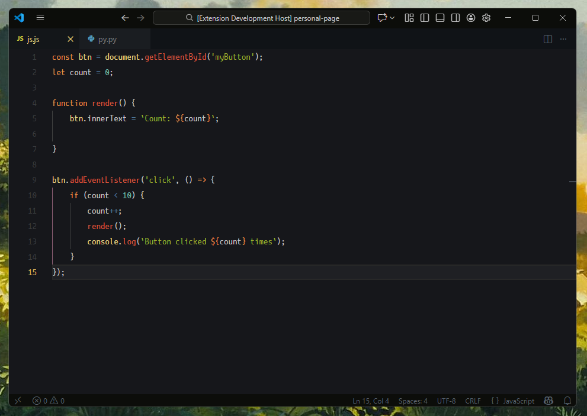
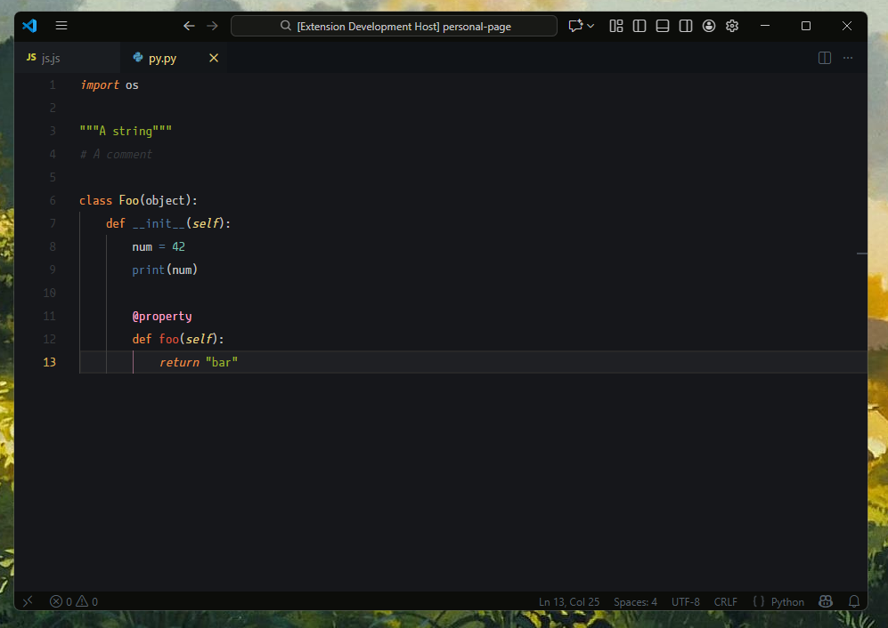

# florence

A dark color theme for vscode, inspired by the ethereal aesthetic of florence & the machine. This theme blends cozy hues with bold accents, aiming to create a workspace that feels both creative and focused.

## Installation

1. Open Visual Studio Code.
2. Go to the Extensions view (`Ctrl+Shift+X`).
3. Search for `florence` and click **Install**.
4. Open the Command Palette (`Ctrl+Shift+P`) and select `Preferences: Color Theme`, then choose **florence**.

## Screenshots

## Contributing

Feel free to open issues or submit pull requests on [GitHub](https://github.com/felipeymn/florence-vscode) to help improve the theme.

---
*too fast for freedom*